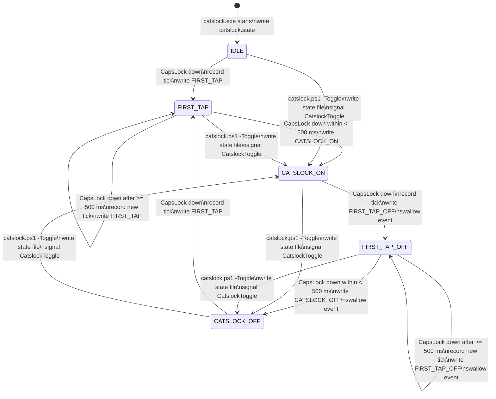

# Catslock

Catslock is a standalone Windows keyboard hook utility. Double-tapping CapsLock
within 500 ms toggles Catslock. When Catslock is on, all keyboard input is
silently discarded.

## Build

With MSVC from a Developer Command Prompt:

```powershell
cmake -S . -B build
cmake --build build --config Release
```

With LLVM and Ninja:

```powershell
cmake -S . -B build-clang -G Ninja -DCMAKE_CXX_COMPILER=clang++
cmake --build build-clang
```

The executable is linked with a `requireAdministrator` UAC manifest because a
global low-level keyboard hook is more reliable when Catslock runs elevated.

## Run

Start the utility:

```powershell
.\build-clang\catslock.exe
```

Or build and launch it as a separate process:

```powershell
.\r.ps1
```

The executable installs a `WH_KEYBOARD_LL` global keyboard hook and creates the
named event `CatslockToggle`. Catslock runs a standard Win32 message pump on the
main thread so the low-level keyboard hook remains active.

Catslock is single-instance. If `catslock.exe` is already running, the run
helpers will not start a duplicate process.

## Autostart

Install Catslock to start automatically at user logon:

1. Download the latest `catslock-*-windows-x64.zip` release.
2. Extract the zip.
3. Double-click `Install Catslock.cmd`.
4. Click `Restart as admin` if prompted, then click `Install`.

The double-click launcher runs the PowerShell GUI installer with the correct
PowerShell flags. Double-clicking `install-catslock-gui.ps1` directly is not
recommended because Windows usually opens `.ps1` files in an editor instead of
running them.

PowerShell install is also available:

```powershell
.\install-catslock-autostart.ps1
```

Or use the GUI installer:

```powershell
.\install-catslock-gui.ps1
```

The installer copies Catslock into `C:\Program Files\Catslock` and creates a
scheduled task named `Catslock` that runs `catslock.exe` in the interactive user
session with highest privileges. This is intentional: a Windows Service runs in
Session 0 and cannot reliably receive the interactive desktop keyboard hook or
show the notification-area icon used by Catslock.

If the executable is not in one of the standard build paths, pass it explicitly:

```powershell
.\install-catslock-autostart.ps1 -ExePath C:\Tools\Catslock\catslock.exe
```

Choose a custom install directory:

```powershell
.\install-catslock-autostart.ps1 -InstallDir C:\Tools\Catslock
```

Remove the autostart task:

```powershell
.\uninstall-catslock-autostart.ps1
```

Remove the task and stop the running process:

```powershell
.\uninstall-catslock-autostart.ps1 -StopProcess
```

Remove the installed files too:

```powershell
.\uninstall-catslock-autostart.ps1 -StopProcess -RemoveFiles
```

## Test

From PowerShell:

```powershell
.\r.ps1
```

Approve the UAC prompt. Then verify the helper can see the running process:

```powershell
Get-Process catslock
```

Check the current state:

```powershell
.\catslock.ps1
```

Toggle through the named-event path:

```powershell
.\catslock.ps1 -Toggle
.\catslock.ps1
.\catslock.ps1 -Toggle
.\catslock.ps1
```

The first toggle should print `Catslock: ON`; the second should print
`Catslock: OFF`. You can also double-tap CapsLock within 500 ms to turn
Catslock on, then double-tap CapsLock again to turn it off.

Inspect diagnostics:

```powershell
Get-Content "$env:TEMP\catslock.log" -Tail 20
```

Stop Catslock after testing:

```powershell
Start-Process -Verb RunAs -FilePath taskkill.exe -ArgumentList '/IM catslock.exe /F' -Wait
```

## Use

Toggle Catslock from the keyboard:

1. Double-tap CapsLock within 500 ms to turn Catslock on.
2. Double-tap CapsLock again within 500 ms to turn Catslock off.

While Catslock is on, the hook returns `1` for keyboard events and does not call
`CallNextHookEx`, so input is swallowed silently. CapsLock events are swallowed
while Catslock is active so the CapsLock LED state does not change during active
Catslock operation. On activation, Catslock also corrects the physical CapsLock
toggle state back to off if the first tap left it enabled.

Query Catslock from any terminal:

```powershell
.\catslock.ps1
```

Output is one of:

```text
Catslock: ON
Catslock: OFF
```

Force a toggle from any terminal:

```powershell
.\catslock.ps1 -Toggle
```

The script rewrites `%TEMP%\catslock.state` and signals `CatslockToggle`. The
C++ process watches that event on a secondary thread and applies the requested
state as an out-of-band override. The named event is created with a relaxed
security descriptor so a non-admin terminal can signal an elevated Catslock
process.

Catslock also adds a notification-area icon while running. Double-click the tray
icon to toggle Catslock, or right-click it to toggle or exit.

## State File

Catslock writes the current state to:

```text
%TEMP%\catslock.state
```

States:

```text
IDLE
FIRST_TAP
CATSLOCK_ON
FIRST_TAP_OFF
CATSLOCK_OFF
```

`catslock.ps1` treats `CATSLOCK_ON` and `FIRST_TAP_OFF` as on. All other known
states are reported as off.

## Diagnostics

Catslock writes a small diagnostic log to:

```text
%TEMP%\catslock.log
```

The log records startup, hook installation, named-event signals, state
transitions, and CapsLock correction attempts. If Catslock appears not to work,
first check that exactly one `catslock.exe` process is running and inspect this
log.

## Mermaid Diagram



## Files

- `src/catslock.cpp`: Windows hook utility and named-event watcher.
- `catslock.ps1`: State query and out-of-band toggle helper.
- `Install Catslock.cmd`: Double-click launcher for the GUI installer.
- `CMakeLists.txt`: Standalone CMake build.
